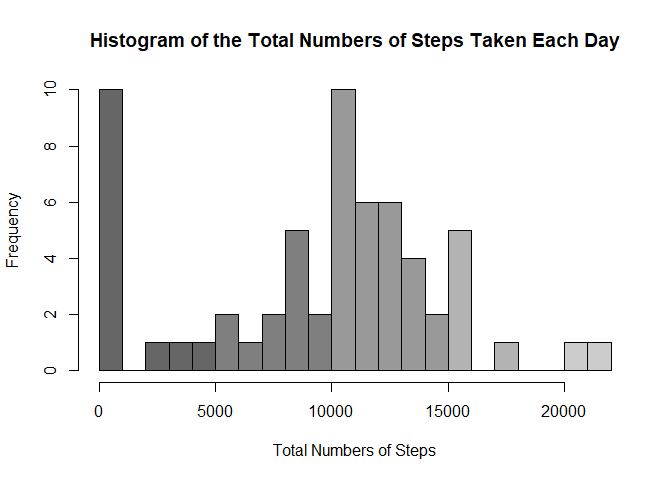
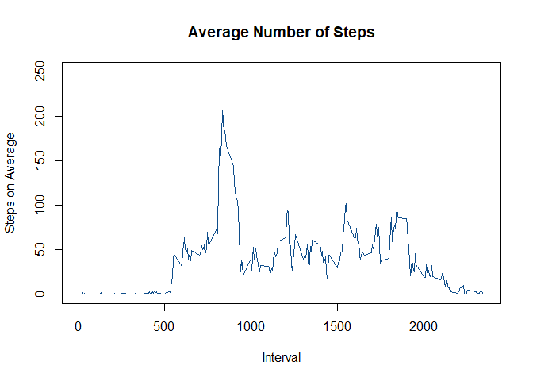
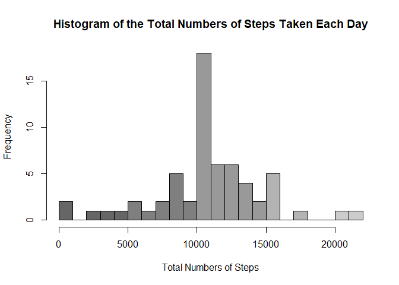
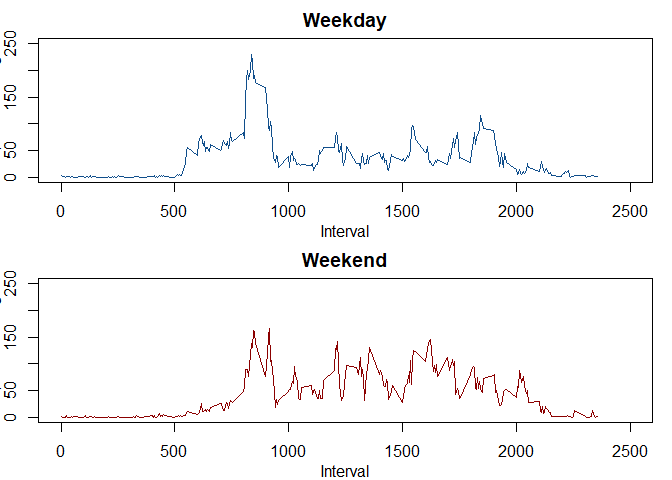

Introduction
------------

Using given
[dataset](https://d396qusza40orc.cloudfront.net/repdata%2Fdata%2Factivity.zip),
write a report that answers the questions detailed below.   
  

------------------------------------------------------------------------

### Loading and preprocessing the data

    # 1. Loading and preprocessing the data
    fileURL <- "https://d396qusza40orc.cloudfront.net/repdata%2Fdata%2Factivity.zip"
    fileName <- "activity.zip"
    folder <- getwd()
    if(!file.exists(paste(folder, "/", fileName, sep=""))) {
            download.file(fileURL, fileName)
            unzip(fileName)
    }
    ## load each data if hasn't loaded yet
    if(!exists("activity")){activity <- read.csv("activity.csv")}

     

------------------------------------------------------------------------

### What is mean total number of steps taken per day?

-   Make a histogram of the total number of steps taken each day
-   Calculate and report the mean and median of the total number of
    steps taken per day

<!-- -->

    # 2. Histogram of the total number of steps taken each day

    ## Calculate the total number of steps taken per day
    daily_freq <- tapply(activity$steps, activity$date, sum, na.rm=TRUE)

    ## Make a histogram of the total number of steps taken each day
    hist(daily_freq, breaks=seq(0, 22000, 1000), 
         col=rep(c("gray40", "gray50", "gray60", "gray70", "gray80"), each=5),
         xlab="Total Numbers of Steps", 
         main="Histogram of the Total Numbers of Steps Taken Each Day")

    # 3. Mean and median number of steps taken each day
    mean_act <- round(mean(daily_freq), digits=2)
    median_act <- round(median(daily_freq), digits=2)

-   The mean and median of the total number of steps taken per day are
    9354.23 and 10395.      

------------------------------------------------------------------------

### What is the average daily activity pattern?

-   Make a time series plot (i.e. type = "l") of the 5-minute interval
    (x-axis) and the average number of steps taken, averaged across all
    days (y-axis)
-   Which 5-minute interval, on average across all the days in the
    dataset, contains the maximum number of steps?

<!-- -->

    # 4. Time series plot of the average number of steps taken
    interval <- unique(activity$interval)
    avg_interval <- tapply(activity$steps, activity$interval, mean, na.rm=TRUE)
    plot(interval, avg_interval, type="l", col="dodgerblue4", ylim=c(0, 250),
         xlab="Interval", ylab="Steps on Average",
         main="Average Number of Steps")

    # 5. The 5-minute interval, on average, contains the maximum number of steps
    max_int <- as.numeric(names(which.max(avg_interval)))

-   The 5-minute interval contains the maximum number of steps on
    average is 835.      

------------------------------------------------------------------------

### Imputing missing values

-   Calculate and report the total number of missing values in the
    dataset
-   Devise a strategy for filling in all of the missing values in the
    dataset.
-   Make a histogram of the total number of steps taken each day and
    Calculate and report the mean and median total number of steps taken
    per day. Do these values differ from the estimates from the first
    part of the assignment? What is the impact of imputing missing data
    on the estimates of the total daily number of steps?

<!-- -->

    # 6. Code to describe and show a strategy for imputing missing data

    ## Calculate and report the total number of missing values in the dataset 
    NAs <- sum(is.na(activity$steps))

    ## replace NAs with average numbers of steps for each interval
    act_ip <- activity #duplicate data for interpolation
    for(i in 1:length(interval)){
            act_ip$steps[is.na(act_ip$steps) 
                         & act_ip$interval==interval[i]] <- avg_interval[i]
    }

    # 7. Histogram of the total number of steps taken each day 
    #    after missing values are imputed

    ## Calculate the total number of steps taken per day
    daily_freq_ip <- tapply(act_ip$steps, act_ip$date, sum, na.rm=TRUE)

    ## Make a histogram of the total number of steps taken each day
    hist(daily_freq_ip, breaks=seq(0, 22000, 1000), 
         col=rep(c("gray40", "gray50", "gray60", "gray70", "gray80"), each=5),
         xlab="Total Numbers of Steps", 
         main="Histogram of the Total Numbers of Steps Taken Each Day")

    ## Mean and median number of steps taken each day
    mean_ip <- round(mean(daily_freq_ip), digits=2)
    median_ip <- round(median(daily_freq_ip), digits=2)

-   To imput missing values, I replaced each NA with the average numbers
    of steps taken in the same interval.

-   There are 2304 NAs in the data. The mean and median total number of
    steps taken per day estimated are 10766.19 and 10766.19. These
    values are different from that of non-imputed data, and the mean of
    the plot has increased since all NAs become average values after
    replacing values.      

------------------------------------------------------------------------

### Are there differences in activity patterns between weekdays and weekends?

    ## Create a new factor variable with two levels – “weekday” and “weekend” 
    act_ip$days <- weekdays(as.Date(act_ip$date))
    days <- unique(act_ip$days)
    for(i in days){
            if(i %in% c("Saturday", "Sunday"))
                    {act_ip$days <- gsub(i, "weekend", act_ip$days)}
            else{act_ip$days <- gsub(i, "weekday", act_ip$days)}
    }
    act_ip$days <- as.factor(act_ip$days)

    ## Plot
    act_ip_wd <- subset(act_ip, days == "weekday")
    act_ip_we <- subset(act_ip, days == "weekend")
    avg_interval_wd <- tapply(act_ip_wd$steps, act_ip_wd$interval, mean, na.rm=TRUE)
    avg_interval_we <- tapply(act_ip_we$steps, act_ip_we$interval, mean, na.rm=TRUE)
    par(mfrow=c(2,1), mar=c(3,2,2,1), mgp=c(2,1,0))
    plot(interval, avg_interval_wd, type="l", col="dodgerblue4", 
         xlim=c(0, 2500), ylim=c(0, 250),
         xlab="Interval", ylab="Steps on Average",
         main="Weekday")
    plot(interval, avg_interval_we, type="l", col="red4", 
         xlim=c(0, 2500), ylim=c(0, 250),
         xlab="Interval", ylab="Steps on Average",
         main="Weekend")

-   On weekdays, the plot shows that people walk a lot only in
    relatively earlier periods of the day, but on weekends, people tend
    to walk more than weekdays on average, and the steps are more evenly
    distributed.
