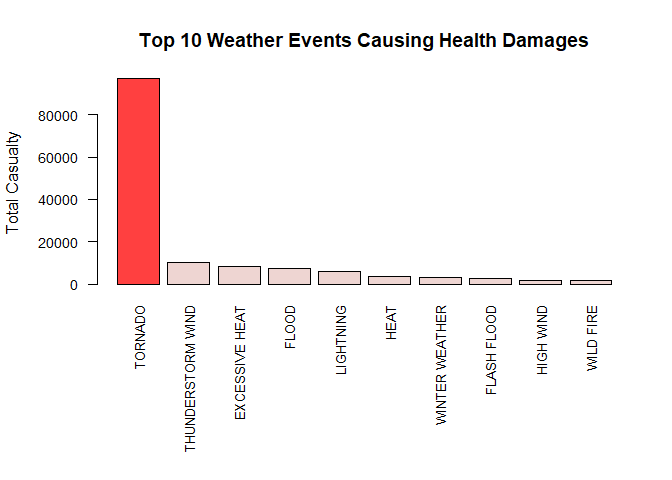
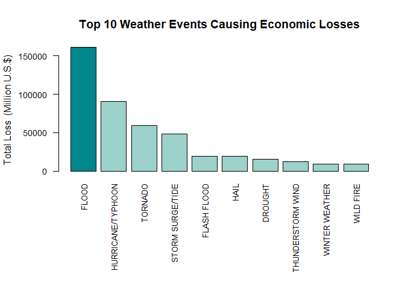

     

1. Synopsis
-----------

This study is to clarify **what kind of weather events happened in the
U.S. have caused the biggest population health damages and economic
losses**. Particularly, it answers to the two major questions below.

1.  Across the United States, which types of events (as indicated in the
    **EVTYPE** variable) are most harmful with respect to population
    health?
2.  Across the United States, which types of events have the greatest
    economic consequences?

To achieve this goal, this study examines the U.S. National Oceanic and
Atmospheric Administration's (NOAA) storm data. The NOAA data used in
this study contains major and minor weather events between 1950 and 2011
and their direct and folowing effects on public health (fatalities and
injuries) and on economy (property damages and crop damages). Although
the [NOAA data instruction
document](https://d396qusza40orc.cloudfront.net/repdata%2Fpeer2_doc%2Fpd01016005curr.pdf)
classifies the weather events into 48 different categories, the data
itself has over 900 different categories including misspelled and
duplicated ones, so this study reorganizes categories in order to make
them a good fit to the guidelines proposed in the instruction document,
and then summarizes accumulated casualties and economic losses of each
category. As the result of the analyses, **Tornadoes** turned out to be
the biggest cause of **health damages**, and **Floods** recorded the
largest **total economic losses**.

     

2. Data Processing
------------------

### 2.1. Downloading Data

The following R script downloads and reads the NOAA storm data. Before
downloading and reading, the script checks whether the target file
already exists, and sets locale to English in advance of reading data to
prevent possible misinterpretation which can be caused by different
language settings.

    Sys.setlocale("LC_ALL", "English") # set LOCALE

    ## [1] "LC_COLLATE=English_United States.1252;LC_CTYPE=English_United States.1252;LC_MONETARY=English_United States.1252;LC_NUMERIC=C;LC_TIME=English_United States.1252"

    options(scipen=999) # turn scientific notation off

    # set file URL and location
    URL <-"https://d396qusza40orc.cloudfront.net/repdata%2Fdata%2FStormData.csv.bz2"
    fileName <- "StormData.csv.bz2"
    folder <- getwd()

    # download and import
    if(!file.exists(paste(folder, "/", fileName, sep="")))
            {download.file(URL, fileName)}

    if(!exists("StormData")){StormData <- read.csv("StormData.csv.bz2", 
                                                   stringsAsFactors = F)}
    str(StormData)

    ## 'data.frame':    902297 obs. of  37 variables:
    ##  $ STATE__   : num  1 1 1 1 1 1 1 1 1 1 ...
    ##  $ BGN_DATE  : chr  "4/18/1950 0:00:00" "4/18/1950 0:00:00" "2/20/1951 0:00:00" "6/8/1951 0:00:00" ...
    ##  $ BGN_TIME  : chr  "0130" "0145" "1600" "0900" ...
    ##  $ TIME_ZONE : chr  "CST" "CST" "CST" "CST" ...
    ##  $ COUNTY    : num  97 3 57 89 43 77 9 123 125 57 ...
    ##  $ COUNTYNAME: chr  "MOBILE" "BALDWIN" "FAYETTE" "MADISON" ...
    ##  $ STATE     : chr  "AL" "AL" "AL" "AL" ...
    ##  $ EVTYPE    : chr  "TORNADO" "TORNADO" "TORNADO" "TORNADO" ...
    ##  $ BGN_RANGE : num  0 0 0 0 0 0 0 0 0 0 ...
    ##  $ BGN_AZI   : chr  "" "" "" "" ...
    ##  $ BGN_LOCATI: chr  "" "" "" "" ...
    ##  $ END_DATE  : chr  "" "" "" "" ...
    ##  $ END_TIME  : chr  "" "" "" "" ...
    ##  $ COUNTY_END: num  0 0 0 0 0 0 0 0 0 0 ...
    ##  $ COUNTYENDN: logi  NA NA NA NA NA NA ...
    ##  $ END_RANGE : num  0 0 0 0 0 0 0 0 0 0 ...
    ##  $ END_AZI   : chr  "" "" "" "" ...
    ##  $ END_LOCATI: chr  "" "" "" "" ...
    ##  $ LENGTH    : num  14 2 0.1 0 0 1.5 1.5 0 3.3 2.3 ...
    ##  $ WIDTH     : num  100 150 123 100 150 177 33 33 100 100 ...
    ##  $ F         : int  3 2 2 2 2 2 2 1 3 3 ...
    ##  $ MAG       : num  0 0 0 0 0 0 0 0 0 0 ...
    ##  $ FATALITIES: num  0 0 0 0 0 0 0 0 1 0 ...
    ##  $ INJURIES  : num  15 0 2 2 2 6 1 0 14 0 ...
    ##  $ PROPDMG   : num  25 2.5 25 2.5 2.5 2.5 2.5 2.5 25 25 ...
    ##  $ PROPDMGEXP: chr  "K" "K" "K" "K" ...
    ##  $ CROPDMG   : num  0 0 0 0 0 0 0 0 0 0 ...
    ##  $ CROPDMGEXP: chr  "" "" "" "" ...
    ##  $ WFO       : chr  "" "" "" "" ...
    ##  $ STATEOFFIC: chr  "" "" "" "" ...
    ##  $ ZONENAMES : chr  "" "" "" "" ...
    ##  $ LATITUDE  : num  3040 3042 3340 3458 3412 ...
    ##  $ LONGITUDE : num  8812 8755 8742 8626 8642 ...
    ##  $ LATITUDE_E: num  3051 0 0 0 0 ...
    ##  $ LONGITUDE_: num  8806 0 0 0 0 ...
    ##  $ REMARKS   : chr  "" "" "" "" ...
    ##  $ REFNUM    : num  1 2 3 4 5 6 7 8 9 10 ...

    dim(StormData)

    ## [1] 902297     37

  

### 2.2. Tidying Up Messy Event Types

Unfortunately, the raw NOAA data is not in the prime condition to
analyze. The types of weather events, which should have been categorized
in 48 kinds (see [NOAA data instruction
document](https://d396qusza40orc.cloudfront.net/repdata%2Fpeer2_doc%2Fpd01016005curr.pdf)
p.6, Table 1), reaches 985 types including typos, different namings on
the same categories, and events and summaries which are not listed in
the instruction. To analyze the data, we need to correct typos and tidy
up the messy event types. **The standard of recategorization follows the
details in the instruction document.**

    StormData$EVTYPE <- toupper(StormData$EVTYPE) # capitalize all

    # correct marks
    a <- StormData$EVTYPE #duplicate first
    a <- gsub("\\(.*\\)", "", a) # remove texts and numbers with parenthesis
    a <- gsub("/", " ", a) # replace '/'s with spaces
    a <- gsub("-", " ", a) # replace '-'s with spaces
    a <- gsub("\\\\", " ", a) #replace '\\'s with spaces
    a <- gsub("  ", " ", a) # remove double spaces
    a <- gsub(";", " ", a) # remove semicolons
    a <- gsub("\\.$", "", a) #remove dots at the end of the strings
    a <- gsub("S$", "", a) # remove plural 'S's
    a <- gsub("^ ", "", a) #remove blanks at the head of the strings
    a <- gsub(" $", "", a) #remove blanks at the end of the strings

    # tidy up labels and correct typos
    # !!CAUTION!! DO NOT CHANGE THE ORDER BELOW
    a[grep("AVA", a)] <- "AVALANCHE"
    a[grep("BLIZ", a)] <- "BLIZZARD"
    a[grep("^(?=.*FLOOD)(?=.*COAS)|(?=.*CSTL)|(?=.*BEACH)", 
                                                   a, perl=TRUE)] <- "COASTAL FLOOD"
    a[grep("EXTREME ",a)] <- "EXTREME COLD/WIND CHILL"
    a[grep("DENSE FOG|^FOG$", a)] <- "DENSE FOG"
    a[a=="FOG AND COLD TEMPERATURE"|a=="FREEZING FOG"|a=="ICE FOG"]<- "FREEZING FOG"
    a[grep("SMOKE", a)] <- "DENSE SMOKE"
    a[grep("DROUGHT", a)] <- "DROUGHT"
    a[grep("DUST D", a)] <- "DUST DEVIL"
    a[grep("G DUST|DUST S|DUSTS", a)] <- "DUST STORM"
    a[grep("E HEAT", a)] <- "EXCESSIVE HEAT"
    a[grep("^HEAT|D HEAT", a)] <- "HEAT"
    a[grep("^(?=.*HEAVY)(?=.*SNOW)", a, perl=TRUE)] <- "HEAVY SNOW"
    a[grep("^(?=.*HEAVY)(?=.*RAIN)|(?=.*PRECI)", a, perl=TRUE)] <- "HEAVY RAIN"
    a[grep("SLEET", a)] <- "SLEET"
    a[grep("FROST", a)] <- "FROST/FREEZE"
    a[grep("^(?=.*FREEZ)(?!.*RAIN)(?!.*SNOW)(?!.*FOG)", 
                                                    a, perl=TRUE)] <- "FROST/FREEZE"
    a[grep("^(?=.*FREEZ)(?=.*RAIN)", a, perl=TRUE)] <- "WINTER WEATHER"
    a[grep("^(?=.*TORN)(?!.*^WATER)", a, perl=TRUE)] <- "TORNADO"
    a[a=="LANDSPOUT"] <- "TORNADO"
    a[grep("^(?=.*THUN)|(?=.*ERSTO)", a, perl=TRUE)] <- "THUNDERSTORM WIND"
    a[grep("^(?=.*TSTM)(?!.*^MARINE)", a, perl=TRUE)] <- "THUNDERSTORM WIND"
    a[grep("(?=.*FUNN)(?!.*WATER)", a, perl=TRUE)] <- "FUNNEL CLOUD"
    a[grep("^(?=.*HAIL)(?!.*MARINE)", a, perl=TRUE)] <- "HAIL"
    a[grep("CURRENT", a)] <- "RIP CURRENT"
    a[grep("SURF", a)] <- "HIGH SURF"
    a[grep("HURR|TYPH", a)] <- "HURRICANE/TYPHOON"
    a[grep("ICE STORM", a)] <- "ICE STORM"
    a[grep("(?=.*FLOOD)(?=.*FLASH)", a, perl=TRUE)] <- "FLASH FLOOD"
    a[grep("^(?=.*FLOOD)(?!.*FLASH)(?!.*COAST)(?!LAKES)", a, perl=TRUE)] <- "FLOOD"
    a[grep("(?=.*URB)(?=.*SM)", a, perl=TRUE)] <- "FLOOD"
    a[grep("LIGHTNING|LIGHTING", a)] <- "LIGHTNING"
    a[a=="MARINE TSTM WIND"] <- "MARINE THUNDERSTORM WIND"
    a[a=="STORM SURGE"|a=="STORM SURGE TIDE"] <- "STORM SURGE/TIDE"
    a[grep("^(?=.*TROP)(?=.*STORM)", a, perl=TRUE)] <- "TROPICAL STORM"
    a[grep("^(?=.*COAST)(?=.*STORM)", a, perl=TRUE)] <- "TROPICAL STORM"
    a[grep("(?=.*VOL)(?=.*ASH)", a, perl=TRUE)] <- "VOLCANIC ASH"
    a[grep("SPOUT", a)] <- "WATERSPOUT"
    a[grep("FIRE", a)] <- "WILD FIRE"
    a[grep("WINTER STORM|SNOWSTORM", a)] <- "WINTER STORM"
    a[grep("(?=.*BURST)|(?=.*GUSTN)", a, perl=TRUE)] <- "THUNDERSTORM WIND"
    a[grep("(?=.*RAIN)(?!.*LOW)(?!.*SNOW)", a, perl=TRUE)] <- "HEAVY RAIN"
    a[grep("(?=.*COLD)(?!.*EXTR)|(?=.*CHIL)(?!.*EXTR)", 
                                                 a, perl=TRUE)] <- "COLD/WIND CHILL"
    a[grep("(?=.*WIND)(?=.*STORM)(?!.*MARIN)", a, perl=TRUE)] <- "THUNDERSTORM WIND"
    a[a=="STORM FORCE WIND"] <- "THUNDERSTORM WIND"
    a[a=="WHIRLWIND"] <- "TORNADO"
    a[grep("^(?=.*HIGH WIND)(?!.*MARINE)", a, perl=TRUE)] <- "HIGH WIND"
    a[grep("^(?=.*WIND)(?!.*MAR)(?!.*CHI)(?!.*HIG)(?!.*STO)(?!.*SNO)", 
                                                     a, perl=TRUE)] <- "STRONG WIND"
    a[grep("(?=.*SNOW)(?=.*EXC)|(?=.*SNOW)(?=.*REC)", a, perl=TRUE)] <- "HEAVY SNOW"
    a[grep("(?=.*SNOW)(?!.*HEA)(?!.*LAK)", a, perl=TRUE)] <- "WINTER WEATHER"
    a[grep("ICE", a)] <- "WINTER WEATHER"
    a[a=="WND"] <- "STRONG WIND"
    a[grep("(?=.*WIN)(?=.*MIX)(?!.*STO)", a, perl=TRUE)] <- "WINTER WEATHER"
    a[grep("HIGH TEMP", a)] <- "HIGH TEMPERATURE"
    a[grep("WARM", a)] <- "WARM TEMPERATURE"
    a[grep("WET", a)] <- "WET WEATHER"
    a[grep("LOW RA", a)] <- "DRYNESS"
    a[grep("DRY|DRI", a)] <- "DRYNESS"
    a[grep("HOT", a)] <- "HIGH TEMPERATURE" 
    a[grep("(?=.*COOL)|(?=.*LOW)(?!.*TIDE)", a, perl=TRUE)] <- "LOW TEMPERATURE"

    #apply changes
    StormData$EVTYPE <- a
    rm(a)

  

### 2.3. Unifying Economic Damage Units

Because the units of property and crop damages in the data vary, we need
to unify them to calculate total economic effects. According to the
[NOAA data instruction
document](https://d396qusza40orc.cloudfront.net/repdata%2Fpeer2_doc%2Fpd01016005curr.pdf)
(p. 12), To record all estimated costs within three digits, different
units("PROPDMGEXP", "CROPDMGEXP") are given: for example, "K" for
thousands, "M" for millions, "B" for billions. As we can see in the
names of the unit columns, the numbers in the unit vectors mean
exponents of 10. The following code chunk converts all different units
into dollars, and calculates dollar-based damage costs of each event in
the data by multiplying three-digit records with converted units.

    # Unify the units of the damage costs in the vectors
    table(StormData$PROPDMGEXP) ; table(StormData$CROPDMGEXP) # check types of exps

    ## 
    ##             -      ?      +      0      1      2      3      4      5 
    ## 465934      1      8      5    216     25     13      4      4     28 
    ##      6      7      8      B      h      H      K      m      M 
    ##      4      5      1     40      1      6 424665      7  11330

    ## 
    ##             ?      0      2      B      k      K      m      M 
    ## 618413      7     19      1      9     21 281832      1   1994

    # create lists of exps
    # reverse vectors orders in order to prevent 0 -> 10^0 -> 10^1
    units <- rev(names(table(StormData$PROPDMGEXP)))
    exps <- rev(c(0, 0, 0, 1, 10^0, 10^1, 10^2, 10^3, 10^4, 10^5, 10^6, 10^7, 10^8, 
              10^9, 10^2, 10^2, 10^3, 10^6, 10^6))

    # replace values
    for(i in 1:19)
            {StormData$PROPDMGEXP[StormData$PROPDMGEXP == units[i]] <- exps[i]
             StormData$CROPDMGEXP[StormData$CROPDMGEXP == units[i]] <- exps[i]}

    # deal with "k"s in CROPDMGEXP
    StormData$CROPDMGEXP[StormData$CROPDMGEXP == "k"] <- 10^3 

    # calculate economic damages
    prop.damages <- StormData$PROPDMG * as.numeric(StormData$PROPDMGEXP)
    crop.damages <- StormData$CROPDMG * as.numeric(StormData$CROPDMGEXP)

    # make a tidy data
    TidyData <- data.frame(as.factor(StormData$EVTYPE), # factorize event types 
                       StormData$FATALITIES, # population health #1
                       StormData$INJURIES,   # population health #2
                       prop.damages, # property damages
                       crop.damages) # crop damages

     

3. Results
----------

### 3.1. Answering Qustion \#1: The biggest cause of casualties

To answer the question, the codes below sum up the fatalities and
injuries of each event type and create a plot of top 10 weather event
types inducing health damages.

    # data for casualties
    Casualty.Data <- data.frame(tapply(TidyData[,2], TidyData[,1], sum),
                                tapply(TidyData[,3], TidyData[,1], sum))
    Casualty.Data$Total <- rowSums(Casualty.Data)
    Casualty.Data <- Casualty.Data[order(-Casualty.Data$Total),]
    colnames(Casualty.Data) <- c("Fatalities", "Injuries", "Total")

    # top 10 causes
    Top.Casualty <- Casualty.Data[1:10,]

    # change plot margins
    par(mar=c(10.1, 5.1, 4.1, 2.1))

    # plot casualties
    barplot(Top.Casualty$Total, names.arg=rownames(Top.Casualty), las=2, 
            cex=0.8, cex.axis=0.9,
            main="Top 10 Weather Events Causing Health Damages",
            col=c("brown1", rep("mistyrose2", 9)))
    mtext(side = 2, "Total Casualty", line = 4)

    Top.Casualty[1,3] # tornado

    ## [1] 97023

    sum(Top.Casualty[2:10,3]) # sum of other top 10 events 

    ## [1] 45208

As we can see in the plot, Tornadoes recorded the largest number of
total casualties(fatalities and injuries), therefore, **tornadoes are
the most harmful with respect to population health.** Total casualties
by tornadoes is about 97000, which exceeds the twice of the casualties
caused by the other events in the top 10 lists(45208).   

### 3.2. Answering Qustion \#2: The biggest cause of economic losses

Likewise, the code chunk below sums up the property and crop damages of
each event type and create a plot of top 10 weather event types inducing
economic damages.

    # change plot margins
    par(mar=c(10.1, 5.1, 4.1, 2.1))

    # data for economic losses
    Economy.Data <- data.frame(tapply(TidyData[,4], TidyData[,1], sum),
                               tapply(TidyData[,5], TidyData[,1], sum))
    Economy.Data$Total <- rowSums(Economy.Data)
    Economy.Data <- Economy.Data[order(-Economy.Data$Total),]
    colnames(Economy.Data) <- c("Property Damages", "Crop Damages", "Total")

    # top 10 causes
    Top.Economy <- Economy.Data[1:10,]

    # plot economic losses
    barplot(round(Top.Economy$Total / 10^6), 
            names.arg=rownames(Top.Economy), las=2, 
            cex=0.8, cex.axis=0.9,
            main="Top 10 Weather Events Causing Economic Losses",
            col=c("turquoise4", rep(rgb(157,209,203, maxColorValue = 255), 9)))
    mtext(side = 2, "Total Loss  (Million U.S.$)", line = 4)

    Economy.Data[1,3] # the biggest - FLOOD

    ## [1] 161063323420

    Economy.Data[2,3] # the second biggest - HURRICANE/TYPHOON

    ## [1] 90872527810

    Economy.Data[3,3] # the third biggest - TORNADO

    ## [1] 58969632944

    # reset plot margins
    par(mar=c(5.1, 4.1, 4.1, 2.1))

As we can see in the plot, **Floods caused over 150 billion dollar
losses for the 60 years recorded($161 billion)**, and it is far beyond
of the second (HURRICANE/TYPHOON, $90 Billion), and the third (TORNADO,
$58 Billion).

     
