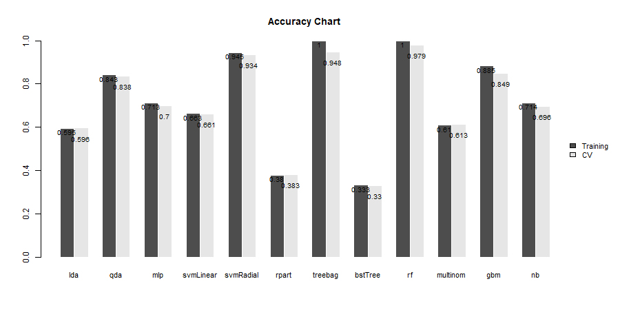
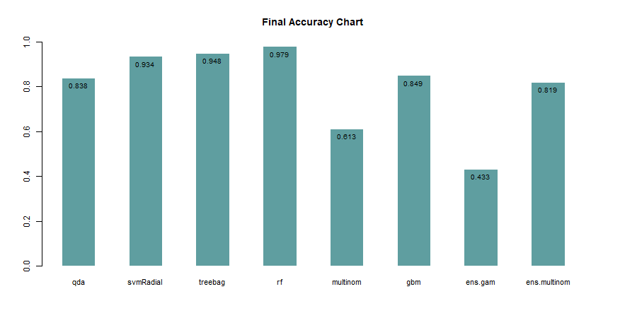

```{r setup, include=FALSE, echo=FALSE}
knitr::opts_chunk$set(echo = TRUE)
library(dplyr); library(caret); library(ggplot2); library(tictoc); library(kableExtra)
# load("8 machine learning assignment.RData") # loading workspace image to speed up
# If you download this file and run everything from scratch, please don't forget to set
# all eval=TRUE to TRUE in all chunks.
```

<br>
<br>

## Introduction

This paper is written as an assignment of Johns Hopkins University Machine Learning Class. It takes a set of accelerometer data which is recorded during 6 participants' barbell lift performances and examines it using different machine learning models. The goals of this study are to predict the manner in which they did the exercise and to determine
which model is the best classifier based on their predictions.  

```{r, getting data, eval=TRUE, echo=FALSE}
# Get files
folder <- getwd()
trainURL <- "https://d396qusza40orc.cloudfront.net/predmachlearn/pml-training.csv"
testURL <- "https://d396qusza40orc.cloudfront.net/predmachlearn/pml-testing.csv"
trainFile <- "pml-training.csv"
testFile <- "pml-testing.csv"

if (!file.exists(paste(folder, "/", trainFile, sep=""))) 
{download.file(trainURL, trainFile)}
if (!file.exists(paste(folder, "/", testFile, sep=""))) 
{download.file(testURL, testFile)}

# Load Data
basedata <- read.csv(trainFile, na.strings=c("NA","","#DIV/0!"))

```

<br>
<br>

## About Data

The data used in this study is Human Activity Recognition Dataset provided by http://groupware.les.inf.puc-rio.br/har. Using wearable devices on the belt, fore arm, arm and dumbell, the data quantifies the movements of 6 participants doing barbell lifts in correct and incorrect ways.The data is composed of two parts: [pml-training](https://d396qusza40orc.cloudfront.net/predmachlearn/pml-training.csv), a large dataset which we mainly use in this machine training, and [pml-testing](https://d396qusza40orc.cloudfront.net/predmachlearn/pml-testing.csv), a small dataset will be used for prediction later. 

<br>
<br>

## Preprocessing Data
The pml-training data is a large one with 19622 observations and 160 variables. One of them is the variable "classe" which we need to predict with other variables. "classe" has 5 different classes from A to E.  

```{r, dimension, echo=FALSE}
print("dimension of pml-training")
dim(basedata)
```

```{r, str, echo=FALSE}
print("classe")
str(basedata$classe)
```

<br>

- Variable removal

We may not need all of 159 predictors. Before training with models, it would be better to optimize the dataset by getting rid of unrelated variables, so that we can save some computing costs. First, we've got to remove NA variables. 

```{r, NA columns, echo=FALSE}
a <- which(is.na(apply(basedata, 2, max)))
print("NA variables")
str(a)
```

There are total 100 NA variables. And there are also some useless variables like index, time, user name, etc. Time data is not an important factor here since all observations are chosen regardless of time order. By removing all unimportant variables, we can cut down the data and make it one with 53 variables including one dependent variable($classe).  

```{r, data, eval=TRUE, echo=FALSE}
## choose NA data
nacols <- apply(basedata, 2, max) %>% is.na %>% which
## choose unnecessary data
nacols <- c(1:7, nacols)
## remove unnecessary data
data <- basedata[,-nacols]
print("data")
dim(data)
```

<br>

- Standardization, splitting data, and dimensionality reduction 

Another good way of saving computing costs is standardizing the data and reducing dimensions with PCA. In order to preserve as much information as possible, The following PCA process keeps 99% of the variance of the initial data. In advance of reducing dimensions, we also need to split data into training, cross-validation, and testing sets, because the same reduction process applied to the training set should be applied to the rests. Here the process splits the data with 3:1:1 ratio.

```{r, standardization and PCA, eval=TRUE, echo=FALSE}
# standardization
## automatically ignore factor-labeled values
standardize.data <- preProcess(data, method=c("center", "scale")) 
data <- predict(standardize.data, data)

# create training/cross-validation/test sets
set.seed(10101)
## split data
inTrain <- createDataPartition(data$classe, p=0.6, list=FALSE) # 60% train
Testsplit <- split(as.integer(rownames(data))[-inTrain], c(1,2))
inCV <- Testsplit[[1]] # 20% Cross Validation
inTest <- Testsplit[[2]] # 20% Test

tr <- data[inTrain,]
cv <- data[inCV,]
ts <- data[inTest,]

print("Split: training set")
dim(tr)
print("Split: cross-validation set")
dim(cv)
print("Split: testing set")
dim(ts)

## PCA of keeping 99% of variance, PCA functions standardize data automatically
pca.data <- preProcess(tr[,-53], method="pca", thresh=0.99)
tr <- cbind(predict(pca.data, tr[,-53]), classe=tr$classe) # apply to train set
cv <- cbind(predict(pca.data, cv[,-53]), classe=cv$classe) # apply to cross validation set
ts <- cbind(predict(pca.data, ts[,-53]),classe=ts$classe) # apply to test set
```

```{r, PCA results, echo=FALSE}
## results
print("PCA: training set")
dim(tr)
```

Keeping 99% of initial variance, we got three datasets of 37 predictors and 1 dependent variable. 

<br>
<br>

## Strategy
The main strategy of model choice in this study has two steps

- Step 1: Comparing single methods and choose the best one 
- Step 2: Run ensemble method with weak classifiers and compare with the Step 1 result 

There are numerous methods of training data. Considering data type of the 5 classes, this study chose 12 training models: 

- Linear Discriminant Analysis (method = 'lda')
- Quadratic Discriminant Analysis (method = 'qda') 
- Multi-Layer Perceptron (method = 'mlp')
- Support Vector Machines with Linear Kernel (method = 'svmLinear') 
- Support Vector Machines with Gaussian Kernel (method = 'svmRadial') 
- Decision Tree (method = 'rpart)
- Decision Tree with Bagging (method = 'treebag')
- Decision Tree with Boosting (method = 'bstTree')
- Random Forest (method = 'rf')
- Multinomial Logistic Regression (method = 'multinom')
- Stochastic Gradient Boosting (method = 'gbm')
- Naive Bayes (method = 'nb)

```{r, main functions, eval=TRUE, echo=FALSE}
# CHANGE OPTIONS eval=TRUE if you want to run the code below while knitting
# train, test, and record errors  
## train-cv, result record function 
validate <- function(model){
  print(model)
  tic() # start runtime record
  mod <- train(classe~., data=tr, method=model) # train
  tictoc <- toc() # end runtime record
  time <- tictoc$toc - tictoc$tic # record elapsed time
  pr.tr <- predict(mod, tr) # predict training set
  pr.cv <- predict(mod, cv) # predict cross validation set
  # accuracy calculation
  tr.accu <- sum(pr.tr==tr$classe)/length(pr.tr)
  cv.accu <- sum(pr.cv==cv$classe)/length(pr.cv)
  
  assign(paste("mod.", model, sep=""), mod, envir=globalenv())
  assign(paste("tr.accu.", model, sep=""), tr.accu, envir=globalenv())
  assign(paste("cv.accu.", model, sep=""), cv.accu, envir=globalenv())
  assign(paste("time.", model, sep=""), time, envir=globalenv())
  assign(paste("pr.tr.", model, sep=""), pr.tr, envir=globalenv())
  assign(paste("pr.cv.", model, sep=""), pr.cv, envir=globalenv())
}

## test set, record function 
test <- function(model){
  mod <- paste("mod.", model, sep="")
  pr.ts <- predict(get(mod), ts) # predict test set
  # beware of using get() for taking characters as a variable name
  cm <- confusionMatrix(pr.ts, ts$classe)
  assign(paste("result.", model, sep=""), cm, envir=globalenv())
  assign(paste("ts.accu.", model, sep=""), cm$overall[1], envir=globalenv())
  assign(paste("pr.ts.", model, sep=""), pr.ts, envir=globalenv())
}

# run each model
models <- c("lda", "qda", "mlp", "svmLinear", "svmRadial", 
            "rpart", "treebag", "bstTree", "rf", 
            "multinom", "gbm", "nb")
for(i in models){
  validate(i)
  test(i)
}


# summarize results
elapsed.time <- vector()
tr.accuracy <- vector()
cv.accuracy <- vector()
ts.accuracy <- vector()
for (i in models){
  elapsed.time <- c(elapsed.time, get(paste("time.", i, sep="")))
  tr.accuracy <- c(tr.accuracy, get(paste("tr.accu.", i, sep="")))
  cv.accuracy <- c(cv.accuracy, get(paste("cv.accu.", i, sep="")))
  ts.accuracy <- c(ts.accuracy, get(paste("ts.accu.", i, sep="")))
  #rm(paste("time.", "i", sep=""))
  #rm(paste("tr.accu.", i, sep=""))
  #rm(paste("cv.accu.", i, sep=""))
  #rm(paste("ts.accu.", i, sep=""))
}
results <- data.frame(elapsed.time, tr.accuracy, cv.accuracy, ts.accuracy)
rownames(results) <- models
```

<br>

#### Step 1: Single Model Comparison

```{r, result table, echo=FALSE}
t1 <- as.table(rbind(round(tr.accuracy,3), round(cv.accuracy,3), round(elapsed.time,3)))
dimnames(t1) <- list(c("Training", "Crossvalidation", "Elapsed Time(sec)"),
                     models)
kable(t1, caption="Model Accuracy") %>%
        kable_styling(bootstrap_options = c("striped", "hover", "condensed", "responsive"))
```

```{r, barplot png creation, eval=TRUE, echo=FALSE}
# plot model training, cv results
png("barplot1.png", width=900, height=450)
bar.df <- t(as.matrix(results[, 2:3]))
par(mar=c(5.1, 4.1, 4.1, 5.1), xpd=TRUE)
bp <- barplot(bar.df, beside=TRUE, border="white", cex.names = 0.9, main = "Accuracy Chart")
## Add text at top of bars
NAs <- rep(NA, 12)
labels <- vector() 
labels1 <- vector() 
labels2 <- vector() 
for(i in 1:length(models)){
        labels <- c(labels, bar.df[,i])
        labels1 <- c(labels1, bar.df[1,i], NAs[i])
        labels2 <- c(labels2, NAs[i], bar.df[2,i])}

text(x = bp, y = labels+0.015, label = round(labels1,3), pos = 1, cex = 0.8, col = "black")
text(x = bp, y = labels-0.015, label = round(labels2,3), pos = 1, cex = 0.8, col = "black")

legend("right", inset=c(-0.08,0), c("Training", "CV"), fill=c("grey30", "grey90"), bty="n", cex=0.9)
dev.off()
```

```{r, plot1, echo=FALSE, out.width = '100%'}

```

Among all 12 models, Random Forest shows the best performance with crossvalidation set (accuracy: 0.979). Tree with Bagging also shows good performance (accuracy:0.948) with much faster computing time than Random Forest (292 < 2505). This can possibly be a good choice in practical uses where computing speed is also important, but here, the standard what we should regard is the accuracy only, so in Step 1, this study chose Random Forest as the best classifier.  

<br>

#### Step 2: Ensemble
In Step 1, we can find some weak classifiers (> 0.5). This study chose 5 methods as a source(qda, mlp, multinom, gbm, nb). Since Adaboost doesn't work with multinomial data, this study tries to emsemble them with Generalized Additive Model (method='gam') and Multinomial Regression (method='multinom'). Elapsed times of 5 methods add up to 2465.36 seconds, which is a little shorter than Random Forest (2505.26 sec), so we can compare the performance of two methods fairly if the ensembling process doesn't take so much time.  

```{r, ensemble, eval=TRUE, echo=FALSE}
# Ensemble
## get training prediction results
predicted.tr <- as.data.frame(matrix(nrow=dim(tr)[1], ncol=length(models)))
iter <- 0
for (i in models){
  iter <- iter + 1
  # predicted.tr[,iter] <- predict(get(paste("mod.", i, sep="")), tr) # predict again
  predicted.tr[,iter] <- get(paste("pr.tr.", i, sep="")) # use data from validate()
}
rm(list=c("i", "iter"))
colnames(predicted.tr) <- models
predicted.tr$classe <- tr$classe


## get cross validation prediction results
predicted.cv <- as.data.frame(matrix(nrow=dim(cv)[1], ncol=length(models)))
iter <- 0
for (i in models){
  iter <- iter + 1
  # predicted.cv[,iter] <- predict(get(paste("mod.", i, sep="")), cv) # predict again
  predicted.cv[,iter] <- get(paste("pr.cv.", i, sep="")) # use data from validate()
}
rm(list=c("i", "iter"))
colnames(predicted.cv) <- models
predicted.cv$classe <- cv$classe


## get testing prediction results
predicted.ts <- as.data.frame(matrix(nrow=dim(ts)[1], ncol=length(models)))
iter <- 0
for (i in models){
  iter <- iter + 1
  # predicted.ts[,iter] <- predict(get(paste("mod.", i, sep="")), ts) # predict again
  predicted.ts[,iter] <- get(paste("pr.ts.", i, sep="")) # use data from test()
}
rm(list=c("i", "iter"))
colnames(predicted.ts) <- models
predicted.ts$classe <- ts$classe


## run with chosen methods to ensemble models
ensemble <- function(colnums, methods){
  print(colnums)
  colnums <- c(colnums, dim(predicted.tr)[2]) # add classe
  tic()
  mod <- train(classe~., data=predicted.tr[,colnums], method=methods)
  tictoc <- toc()
  time <- tictoc$toc - tictoc$tic
  pr.tr <- predict(mod, predicted.tr[,colnums])
  pr.cv <- predict(mod, predicted.cv[,colnums])
  pr.ts <- predict(mod, predicted.ts[,colnums])
  cm <- confusionMatrix(pr.ts, predicted.ts$classe)
  assign(paste("tr.accu.ensemble.", methods, sep=""), 
         sum(pr.tr==predicted.tr$classe)/length(pr.tr), envir=globalenv())
  assign(paste("cv.accu.ensemble.", methods, sep=""), 
         sum(pr.cv==predicted.cv$classe)/length(pr.cv), envir=globalenv())
  assign(paste("result.ensemble.", methods, sep=""), cm, envir=globalenv())
  assign(paste("ts.accu.ensemble.", methods, sep=""), 
         cm$overall[1], envir=globalenv())
  assign(paste("time.ensemble.", methods, sep=""), time, envir=globalenv())
}

## convert predicted results into numeric values
predicted.tr <- as.data.frame(sapply(predicted.tr, as.numeric))
predicted.cv <- as.data.frame(sapply(predicted.cv, as.numeric))
predicted.ts <- as.data.frame(sapply(predicted.ts, as.numeric))
predicted.tr$classe <- tr$classe
predicted.cv$classe <- cv$classe
predicted.ts$classe <- ts$classe

## Check correlation 
correlations <- cor(predicted.cv[,c(2,3,10,11,12)])

## run ensemble using multinomial regression
list.ensemble <- c("gam", "multinom")
for(i in list.ensemble){
  ensemble(c(2,3,10,11,12), i)
}
```

```{r, ensemble table, echo=FALSE}
ensemble.tr.accuracy <- c(tr.accu.ensemble.gam, tr.accu.ensemble.multinom)
ensemble.cv.accuracy <- c(cv.accu.ensemble.gam, cv.accu.ensemble.multinom)
ensemble.elapsed.time <- c(sum(elapsed.time[c(2,3,10,11,12)], time.ensemble.gam), 
                           sum(elapsed.time[c(2,3,10,11,12)], time.ensemble.multinom))


t2 <- as.table(rbind(round(ensemble.tr.accuracy,3), round(ensemble.cv.accuracy,3)
                     , round(ensemble.elapsed.time,3)))
dimnames(t2) <- list(c("Training", "Crossvalidation", "Total Elapsed Time Taken with Base Models and Ensemble(sec)"),
                     list.ensemble)
kable(t2, caption="Ensemble Model Accuracy") %>%
        kable_styling(bootstrap_options = c("striped", "hover", "condensed", "responsive"))
```

As interesting result has come out that multinomial regression recorded almost twice better accuracy in both training and crossvalidation sets. However, both of them are still worse than Random Forest alone, even than Tree with Bagging or SVM with Gaussian Kernel, and similar with Quadratic Discriminant Analysis which only takes 4.72 seconds alone.   

```{r, final plot creation, eval=TRUE, echo=FALSE}
# final plot
png("barplot2.png", width=900, height=450)
bar.final <- t(as.matrix(c(cv.accuracy[c(2, 5, 7, 9, 10, 11)], ensemble.cv.accuracy)))
colnames(bar.final) <- c(models[c(2, 5, 7, 9, 10, 11)], "ens.gam", "ens.multinom")
rownames(bar.final) <- "Cross Validation Accuracy"
par(mar=c(5.1, 4.1, 4.1, 5.1), xpd=TRUE)
bpf <- barplot(bar.final, border="white", cex.names = 0.9, main = "Final Accuracy Chart", 
        col=c("cadetblue"), space=1, ylim=c(0,1))
## Add text at top of bars
text(x = bpf, y = bar.final[1,], label = round(bar.final[1,],3), pos = 1, cex = 0.8, col = "black")
dev.off()
```

```{r, plot2, echo=FALSE, out.width = '100%'}

```

<br>
<br>

## Test Result
To sum up, **Random Forest** is the best classifier. The performance of Random Forest with Test set is about **0.978**

```{r, test set rf, echo=FALSE}
print("Random Forest Accuracy with Test Set")
ts.accu.rf
```

<br>
<br>

## Making Prediction with Testing Dataset
At last, we can make predictions with Testing Data(pml-testing) using Random Forest.

```{r, pml-testing, echo=FALSE}
# apply the model to the testing data and predict classes        
data.testing <- read.csv(testFile, na.strings=c("NA","","#DIV/0!"))        
data.testing <- data.testing[,-nacols]

testing <- predict(pca.data, data.testing[,-53])
pr.testing.treebag <- predict(mod.treebag, testing)
pr.testing.rf <- predict(mod.rf, testing)
pr.testing.qda <- predict(mod.qda, testing)
pr.testing.svmRadial <- predict(mod.svmRadial, testing)

print("Random Forest Prediction with 'pml-testing' Dataset")
pr.testing.rf
```